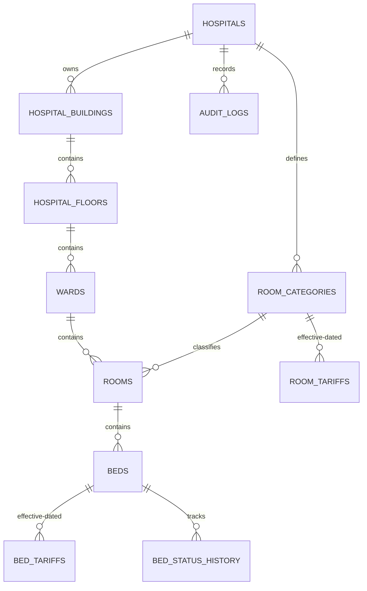
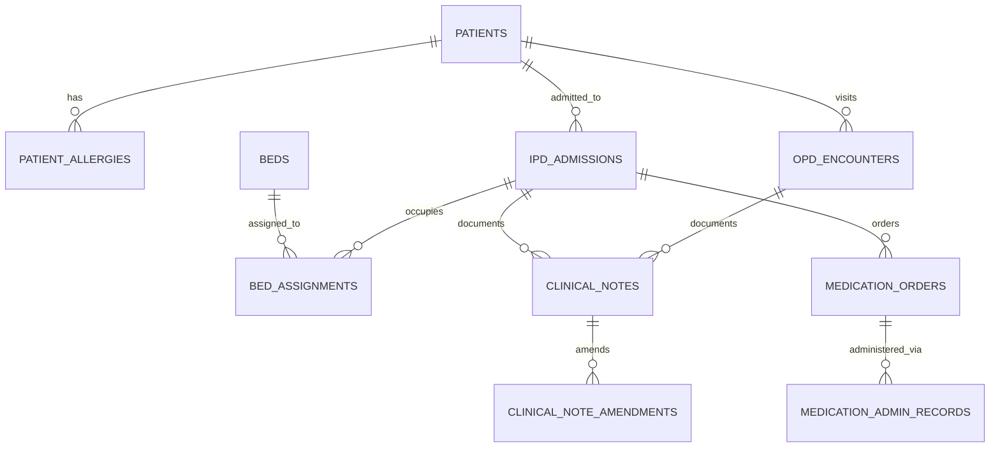
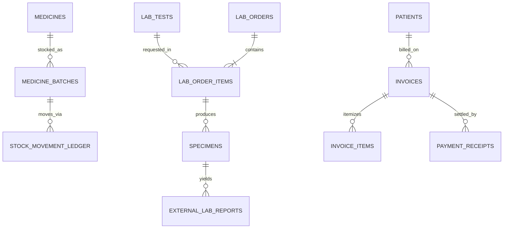

# MediCore HMS — Domain ER Diagrams

## 1. Tenant, Identity & Infrastructure Domain

```mermaid
erDiagram
    HOSPITALS ||--o{ HOSPITAL_BUILDINGS : owns
    HOSPITALS ||--o{ ROOM_CATEGORIES : defines
    HOSPITALS ||--o{ AUDIT_LOGS : records
    HOSPITAL_BUILDINGS ||--o{ HOSPITAL_FLOORS : contains
    HOSPITAL_FLOORS ||--o{ WARDS : contains
    WARDS ||--o{ ROOMS : contains
    ROOM_CATEGORIES ||--o{ ROOMS : classifies
    ROOMS ||--o{ BEDS : contains
    ROOM_CATEGORIES ||--o{ ROOM_TARIFFS : "effective-dated"
    BEDS ||--o{ BED_TARIFFS : "effective-dated"
    BEDS ||--o{ BED_STATUS_HISTORY : tracks
```

## 2. Patient, OPD, IPD & Clinical Domain

```mermaid
erDiagram
    PATIENTS ||--o{ PATIENT_ALLERGIES : has
    PATIENTS ||--o{ OPD_ENCOUNTERS : visits
    PATIENTS ||--o{ IPD_ADMISSIONS : admitted_to
    IPD_ADMISSIONS ||--o{ BED_ASSIGNMENTS : occupies
    BEDS ||--o{ BED_ASSIGNMENTS : assigned_to
    OPD_ENCOUNTERS ||--o{ CLINICAL_NOTES : documents
    IPD_ADMISSIONS ||--o{ CLINICAL_NOTES : documents
    CLINICAL_NOTES ||--o{ CLINICAL_NOTE_AMENDMENTS : amends
    IPD_ADMISSIONS ||--o{ MEDICATION_ORDERS : orders
    MEDICATION_ORDERS ||--o{ MEDICATION_ADMIN_RECORDS : administered_via
```

## 3. Pharmacy, External Lab & Billing Domain

```mermaid
erDiagram
    MEDICINES ||--o{ MEDICINE_BATCHES : stocked_as
    MEDICINE_BATCHES ||--o{ STOCK_MOVEMENT_LEDGER : moves_via
    LAB_TESTS ||--o{ LAB_ORDER_ITEMS : requested_in
    LAB_ORDERS ||--|{ LAB_ORDER_ITEMS : contains
    LAB_ORDER_ITEMS ||--o{ SPECIMENS : produces
    SPECIMENS ||--o{ EXTERNAL_LAB_REPORTS : yields
    PATIENTS ||--o{ INVOICES : billed_on
    INVOICES ||--o{ INVOICE_ITEMS : itemizes
    INVOICES ||--o{ PAYMENT_RECEIPTS : settled_by
```
